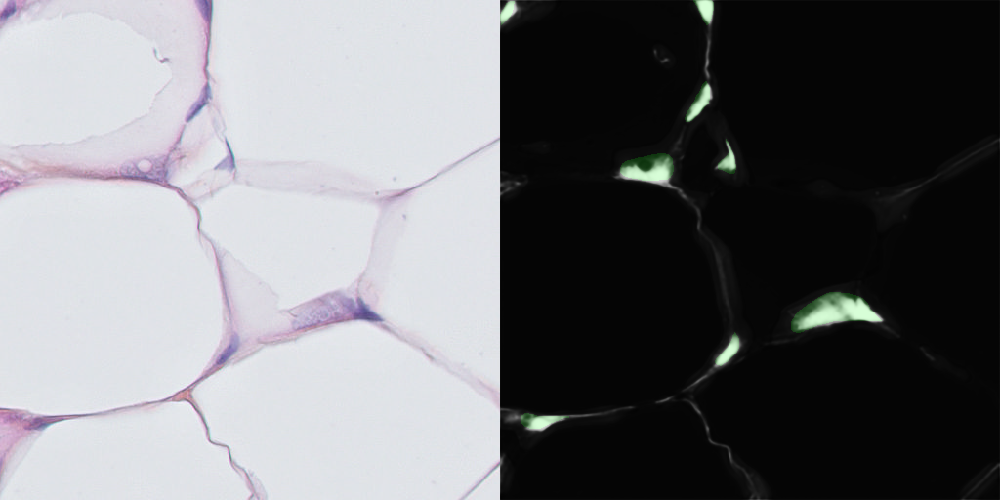
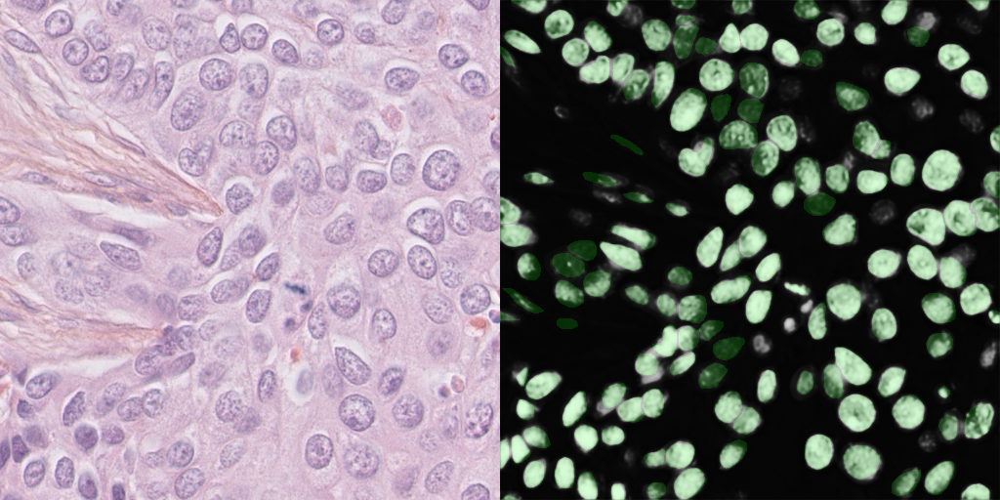

# Cell Nuclei Segmentation Problem
## By: Theodore Nowak, 10/17/18

Example images from data set with green labels overlaying network predictions.

## Problem Statement
Segment the cell nuclei in histology slides.

### Classes
0. background
1. cell

### Target 1
Implement a reasonable baseline model

### Target 2
Try something different as an extension/alteration to the baseline model that
I think would improve results.

### Bonus Points
 - Creativity!
 - Not using existing repos!

### Reasonable Things
 - Using existing libraries and frameworks (SKL, Keras, etc.)

## Approach

### Dataset

#### Train/Val Split

After reviewing the data set, I decided to split by Slide. Specifically, I
chose the Training set to be Slides 1-10 and the Validation set to be Slides
11-12. This is reasonable because after review, there did not seem to be
noticeable variation between each slide.

#### CellHistology Class

CellHistology extends the pytorch Dataset class and overrides `__getitem__` to
return image, label pairs. It also preprocesses the data saving each label as a
`.npy` file, the data set mean as `mean.npy`, and the data set standard
deviation as `std.npy`. It additionally supplies a `visualize` function to
view and evaluation the model output and performance after training.

### Model

[UNet](https://arxiv.org/abs/1505.04597) was used. In addition to being a
well known, well used model for semantic segmentation, it was developed for
cell segmentation. A pytorch implementation of the UNet model was found
 [here]( https://github.com/milesial/Pytorch-UNet) and used to save time.

### Training

To train, use `python train.py`

**Loss:** Binary Cross Entropy loss was used

**Optimizer:** Adam optimizer was used

**Learning Scheduler:** A starting learning rate of 1e-3 was used which was
reduced exponentially by a factor of .8 each epoch.

**Batch Size:** A batch size of 1 was used due to hardware restrictions.

**Epochs:** The network was trained for 30 epochs.

**Metrics:** Mean Intersection over Union was used to evaluate performance.

### Evaluation

To evaluate, use `python eval.py`

`eval.py` steps through the data set and visualizes some of the images alongside
 their predictions. It additionally calculates the Mean IoU of the final model
 over the Validation Set.

 With a probability threshold for classification of .5, the model achieves a
 Mean IoU of 22.86%.

### Innovation

Issues with performance:
1. Qualitatively, most misclassification from interstitial tissue as nuclei
2. Not converged on training set (especially on hard images)
3. Tends to stabilize at getting same nuclei "easy" nuclei

Best options (in descending order):
1. Hard negative mining
2. Further data augmentation and training
3. Using a pixel-wise weight mask as used in the
  [UNet paper.](https://arxiv.org/abs/1505.04597)
4. A modified loss function to greater penalize misclassified background

Pursuing `2` because most tenable in short period.

**Results:** Adding vertical flips and random rotations in addition to
  horizontal flips during training actually decreased performance. While is not
  clear why such dataset augmentations would actually decrease validation set
  accuracy, what is clear is that more significant modifications such as hard
  negative mining and additional loss factors are necessary to get any real
  change in accuracy.
